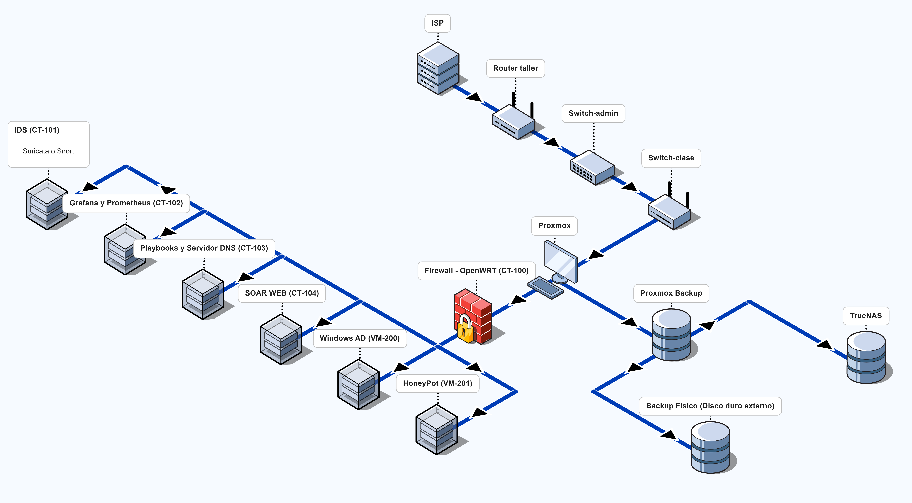

 🔐 SOC — Esquema de Red Fase 1

## Diagrama de red

## Tabla de componentes

| CT/VM | Servicio          | IP             | Puerto | Tecnología              |
|-------|-------------------|----------------|--------|-------------------------|
| CT 100 | Firewall         | 10.10.10.1     | —      | OpenWRT · LXC           |
| CT 101 | IDS              | 10.10.10.10    | —      | Snort / Suricata        |
| CT 102 | Grafana          | 10.10.10.20    | 3000   | Docker                  |
| CT 103 | Prometheus       | 10.10.10.21    | 9090   | Docker                  |
| CT 104 | SOAR Web         | 10.10.10.30    | 80     | PHP + MariaDB           |
| CT 105 | Playbooks        | 10.10.10.40    | —      | Bash + SMTP             |
| VM 200 | Windows AD       | 10.10.10.100   | —      | Windows Server          |
| VM 201 | Backup           | 10.10.10.50    | —      | Proxmox Backup Server   |
